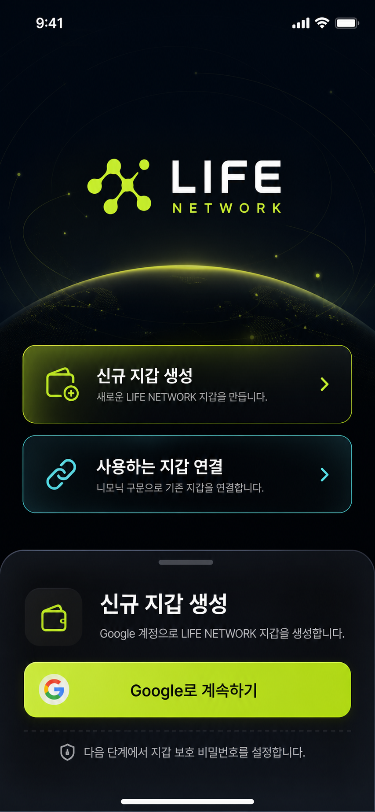

# LIFE NETWORK Pre-Login Onboarding Mockup

## Purpose

This document defines the UI mockup plan for the LIFE NETWORK pre-login onboarding flow.
The scope is visual planning only: screen states, layout hierarchy, user-facing copy, and security messaging.

Actual Google OAuth, wallet creation, mnemonic import, password storage, encryption, and navigation logic are out of scope for this mockup pass.

## Visual Reference

## Entry Screen: Welcome

The first screen should be simple and brand-led. The user should immediately understand that they are entering LIFE NETWORK and must choose between creating a new wallet or connecting an existing one.

### Primary Elements

- `LIFE NETWORK` logo as the main visual anchor.
- Primary CTA: `신규 지갑 생성`
- Secondary CTA: `사용하는 지갑 연결`
- Minimal supporting copy, focused on wallet ownership and secure access.

### Layout

- Dark black/deep navy background.
- LIFE lime accent on the logo and primary CTA.
- Premium mobile wallet feel, not a landing page.
- Two wallet path buttons near the lower half of the screen.
- No biometric, fingerprint, WalletConnect, MetaMask, or Trust Wallet entry points in this version.

## Flow A: New Wallet Creation

### Step A1: Create Wallet Bottom Sheet

Triggered by tapping `신규 지갑 생성`.

The screen stays in place and a bottom sheet rises from the bottom.

#### UI Copy

- Title: `신규 지갑 생성`
- Body: `Google 계정으로 LIFE NETWORK 지갑을 생성합니다.`
- Primary CTA: `Google로 계속하기`
- Note: `다음 단계에서 지갑 보호 비밀번호를 설정합니다.`

#### UX Notes

- This is a mockup state only.
- The Google button should advance the mockup to password setup.
- It should not perform real OAuth in this pass.

### Step A2: Create Wallet Password

New wallets must also set a password. This password is presented as an app lock and wallet protection password, not an on-chain wallet password.

#### UI Copy

- Title: `지갑 보호 비밀번호 설정`
- Body: `LIFE NETWORK에 다시 접속할 때 사용할 비밀번호를 설정하세요.`
- Field: `비밀번호`
- Field: `비밀번호 확인`
- Primary CTA: `비밀번호 설정`

#### Password Requirement UI

- `8자 이상`
- `영문/숫자 조합`
- `분실 시 복구가 어려울 수 있음을 확인`

The mockup may show these as checklist rows. Real validation is not required in this pass.

## Flow B: Existing Wallet Connection

### Step B1: Import Wallet Mnemonic

Triggered by tapping `사용하는 지갑 연결`.

This flow means mnemonic-based import. External wallet connection is explicitly excluded from this screen.

#### UI Copy

- Title: `기존 지갑 연결`
- Body: `니모닉 구문으로 사용 중인 BSC 지갑을 연결합니다.`
- Input placeholder: `12 또는 24개 단어를 입력하세요`
- Primary CTA: `다음`

#### Security Copy

- `니모닉은 누구에게도 공유하지 마세요.`
- `이 데모에서는 실제 저장/전송 없이 UI 흐름만 보여줍니다.`

### Step B2: Import Wallet Password

Imported wallets also require password setup.

#### UI Copy

- Title: `가져온 지갑 보호`
- Body: `이 지갑을 LIFE NETWORK에서 사용할 때 필요한 비밀번호를 설정하세요.`
- Field: `비밀번호`
- Field: `비밀번호 확인`
- Primary CTA: `지갑 연결 완료`

This screen should reuse the same password layout as new wallet creation.

## Complete State

Both flows end in a shared completion screen.

### New Wallet Complete

- Title: `새 지갑이 준비되었습니다`
- Body: `LIFE NETWORK 지갑이 생성되었습니다.`
- CTA: `월렛으로 이동`

### Existing Wallet Complete

- Title: `지갑이 연결되었습니다`
- Body: `기존 지갑을 LIFE NETWORK에서 사용할 수 있습니다.`
- CTA: `월렛으로 이동`

The CTA can remain mock-only or call the existing demo sign-in action in a later implementation pass.

## UX Rules

- Fingerprint or biometric authentication is excluded.
- WalletConnect, MetaMask, Trust Wallet, and other external wallet connection flows are excluded.
- New wallet creation and existing wallet connection both require password setup.
- Mnemonic import is represented as UI only.
- Password is described as an app lock and wallet protection password.
- The welcome screen should not look like a marketing page.
- The main choice must be visible without scrolling on a 390px mobile viewport.

## Visual Direction

- Background: black and deep navy.
- Primary accent: LIFE lime.
- Secondary accent: cyan for security/network hints.
- Bottom sheet: premium fintech style with rounded top corners and a subtle translucent surface.
- Buttons: one clear primary action per state.
- Cards should be restrained and functional, not decorative.

## Test Criteria For Future Implementation

- `/sign-in` shows `LIFE NETWORK`, `신규 지갑 생성`, and `사용하는 지갑 연결` immediately.
- `신규 지갑 생성` opens the Google bottom sheet.
- `Google로 계속하기` advances to new wallet password setup.
- `사용하는 지갑 연결` advances to mnemonic import.
- Mnemonic import advances to imported wallet password setup.
- Both password flows can reach a complete state.
- 390px mobile width has no clipped buttons, overlapping text, or hidden primary CTA.
- Future implementation should pass:
  - `npm run typecheck`
  - `npm run lint`
  - `npx expo-doctor`

## Implementation Notes

- Preferred component location: `src/features/auth/components/sign-in-panel.tsx`.
- Suggested UI state names:
  - `welcome`
  - `create-sheet`
  - `create-password`
  - `import-mnemonic`
  - `import-password`
  - `complete`
- Real secret handling must be implemented later with secure storage and no raw mnemonic persistence.
